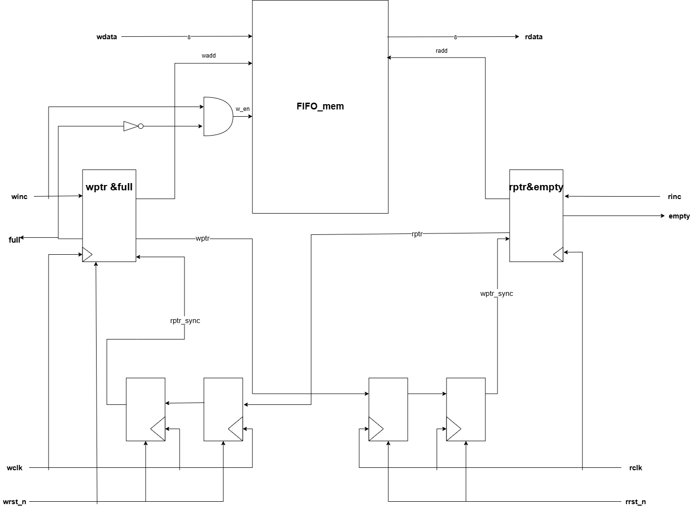
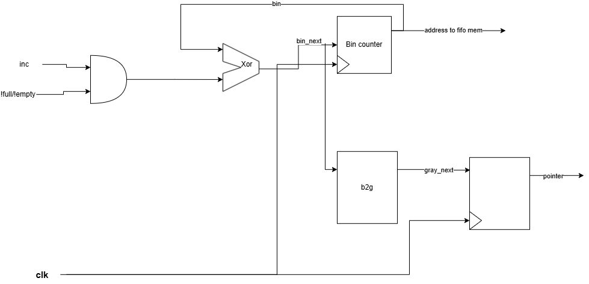

# Author
Minh Khoa

# Introduction
- **FIFO** stands for "First In, First Out". It is a type of data structure or buffer in which the first data element added is the first one to be removed.
- **Asynchronous FIFO** is a FIFO buffer where the read and write operations are controlled by independent clock domains. This means the reading process and writing process are driven by at least two different clock domains.
- **Asynchronous FIFOs are typically used in:**
  - **Interfacing between different clock speeds:** For example, transferring data between a high-speed processing unit and a slower peripheral.
  - **Communication between different modules:** For example, in a System-on-Chip (SoC) where various blocks might operate at different clock frequencies.

# Architecture

## 1. Block Diagram

## 2. Interface Signals

| Signal Name | Direction | Width | Description                            |
| :---        | :---:     | :---: | :---                                   |
| `rclk`      | Input     | 1     | Read clock                             |
| `wclk`      | Input     | 1     | Write clock                            |
| `r_rst_n`   | Input     | 1     | Read reset (active low)                |
| `w_rst_n`   | Input     | 1     | Write reset (active low)               |
| `winc`      | Input     | 1     | Write enable / Increment write pointer |
| `rinc`      | Input     | 1     | Read enable / Increment read pointer   |
| `wdata`     | Input     | 8     | Write data input                       |
| `rdata`     | Output    | 8     | Read data output                       |
| `full`      | Output    | 1     | FIFO full flag                         |
| `empty`     | Output    | 1     | FIFO empty flag                        |

## 3. Internal Modules
- **`FIFO_mem`**: The memory block (Dual-port RAM) used to store and retrieve data.
- **`flip_flop_synchronizer`**: Synchronizes the read and write pointers across different clock domains using 2-stage flip-flops to prevent metastability.
- **`Gray_decode`**: To convert binary to gray code.
- **`rptr_empty`**: Controls the read pointer (using Gray code) and generates the `empty` flag condition.
- **`wptr_full`**: Controls the write pointer (using Gray code) and generates the `full` flag condition.